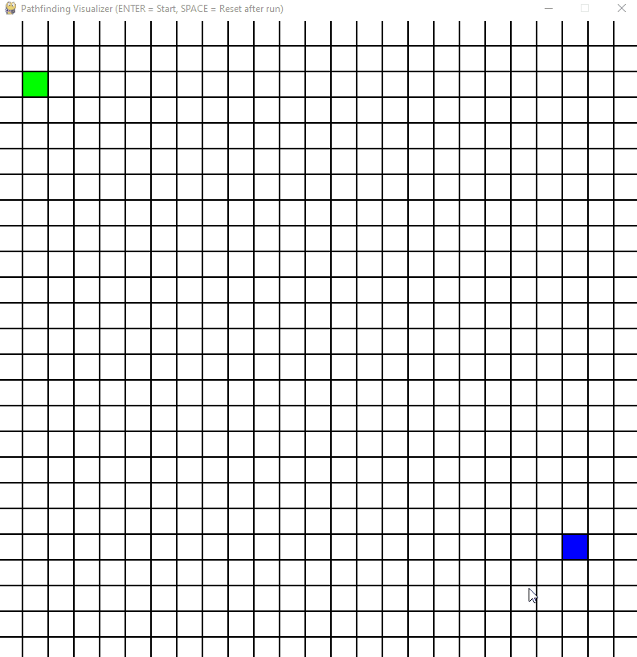

# Pathfinding Visualizer
🔎 Pathfinding visualizer made in Python with Pygame

This program currently only support BFS.

# Running
Install the required dependencies:

`pip install -r requirements.txt`

Run the main file:

`python main.py`

# Usage
Press *Enter* to run BFS.

Press *Space* after the algorithm has finished running to reset the map.

Hold *Left Mouse Button* to draw obstacles.

Hold *Right Mouse Button* to remove obstacles.

Press *Escape* to quit.

# Modifying
On `main.py` you can change the `width`, `height`, `rows`, `cols`, `start`, `dest` variables and give them your desired values.